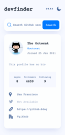

# Web app Challenge: GitHub user search

## Table of contents

- [Overview](#overview)
  - [The challenge](#the-challenge)
  - [Screenshot](#screenshot)
  - [Links](#links)
- [My process](#my-process)
  - [Built with](#built-with)
  - [What I learned](#what-i-learned)
  - [Continued development](#continued-development)
  - [Useful resources](#useful-resources)
- [Author](#author)
- [Acknowledgments](#acknowledgments)

## Overview

### The challenge

Users should be able to:

- View the optimal layout for the app depending on their device's screen size
- See hover states for all interactive elements on the page
- Search for GitHub users by their username
- See relevant user information based on their search
- Switch between light and dark themes
- **Bonus**: Have the correct color scheme chosen for them based on their computer 
preferences. _Hint_: Research `prefers-color-scheme` in CSS.

### Screenshot

### Links

- Solution URL: [github-users-cmode01](https://github.com/jhnemogap/github-users-cmode01)
- Live Site URL: [DEVFINDER live demo](https://github-users-cmode01.vercel.app/)

## My process

### Built with

- Semantic HTML5 markup
- Mobile-first workflow
- CSS custom properties, Flexbox, CSS Grid
- [React](https://reactjs.org/) - JS library
- [Next.js](https://nextjs.org/) - React framework
- [TypeScript](https://www.typescriptlang.org/docs/handbook/react.html) - 
TypeScript is JavaScript with syntax for types.

- [Sass](https://sass-lang.com/) - For styles using 
[scss modules](https://nextjs.org/docs/basic-features/built-in-css-support#adding-component-level-css)

- [ESlint](https://eslint.org/) - Find and fix problems in your JavaScript styles code

- [Prettier](https://prettier.io/) - An opinionated code formatter

- [husky](https://www.npmjs.com/package/husky) +
[lint-staged](https://github.com/okonet/lint-staged) +
[Conventional Commits](https://www.conventionalcommits.org/en/v1.0.0/) - 
Superpowers when performing particular git actions

- [Node Version Manager](https://github.com/nvm-sh/nvm) - `nvm` allows you to quickly 
install and use different versions of node via the command line. Its installation 
is prior to and separate from the project. If you do not have this, it is recommended 
to install the local version of node.js indicated by the `.nvmrc` file

### What I learned

This section summarizes some of the main learnings while working on this project.

XXXXXXXXX

### Continued development

Use this section to outline areas that you want to continue focusing on in future 
projects. These could be concepts you're still not completely comfortable with 
or techniques you found useful that you want to refine and perfect.

XXXXXXX

### Useful resources

- [MDN Web Docs](https://developer.mozilla.org/en-US/) - It is for me the essential 
documentation of HTML, CSS and JavaScript (and more). On many occasions, by rereading a 
concept that I already know, I can reinforce it or learn something new.

- [W3Schools](https://www.w3schools.com/) - It may not be as flashy as MDN but in many 
cases it is very useful because its explanations are based on direct and quick examples.

- [CSS Flexbox](https://css-tricks.com/snippets/css/a-guide-to-flexbox/) +
[CSS Grid](https://css-tricks.com/snippets/css/complete-guide-grid/) - 
comprehensive guide to CSS flexbox and Grid layout. 
When the concern is about CSS flexbox or Grid, this is the most important resource that is used. 

- [React TypeScript Cheatsheets](https://react-typescript-cheatsheet.netlify.app/) -
Cheatsheets for experienced React developers getting started with TypeScript.
Especially since it contains various details applied to function components and hooks.

- [Esencial image editor](https://ezgif.com/)
- [Smart WebP, PNG and JPEG compression](https://tinypng.com/)

## Author

- Name: Jorge Humberto Nemogá Pinzón
- Linkedin - [jhnemogap](https://www.linkedin.com/in/jhnemogap)

## How does the project run on the local machine?

- XXXXXXXXX
